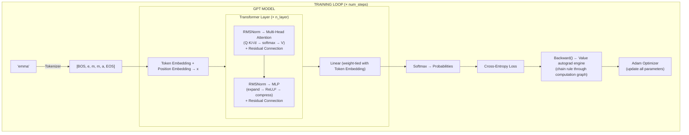

# MicroGPT.cs

[](https://github.com/milanm/AutoGrad-Engine/actions/workflows/build.yml)
[](LICENSE)
[](https://dotnet.microsoft.com/)

A complete [GPT](https://en.wikipedia.org/wiki/Generative_pre-trained_transformer) language model (training and inference) in pure C# with zero dependencies.

Faithful port of [Andrej Karpathy's microgpt.py](https://gist.github.com/karpathy/8627fe009c40f57531cb18360106ce95).

## What is this?

This is the exact same algorithm that powers ChatGPT, in ~400 lines of code across 4 files (plus extensive comments explaining every piece). No PyTorch, no TensorFlow, no NuGet packages. Just plain C# and math.

It trains a tiny GPT model on a list of human names, then generates new ones that sound real but never existed.

**This is not production code.** It's an educational tool. It processes one number at a time where real implementations process millions in parallel on GPUs. But every conceptual piece of a real GPT is here.

**New to ML?** Start with the [Prerequisites guide](PREREQUISITES.md) — it covers all the math and ML concepts you need, from scratch.

## Project Structure

| File | Responsibility |
|---|---|
| `Value.cs` | Autograd engine — wraps scalars with automatic gradient tracking |
| `Tokenizer.cs` | Character-level tokenizer with `Encode()`/`Decode()` |
| `NeuralOps.cs` | Stateless neural-net building blocks: `Linear`, `Softmax`, `RMSNorm` |
| `Program.cs` | GPT model, training loop (`Train`), and generation (`Generate`) |
| `ValueTests.cs` | 25 tests — numerical gradient checking, ops correctness, roundtrips |

## Architecture



## Quick Start

```bash
cd src/AutogradEngine
dotnet run
```

Or with custom settings:

```bash
dotnet run -- --n_embd 32 --n_layer 2 --num_steps 2000
```

### Running Tests

The autograd engine is verified with numerical gradient checking — the same technique PyTorch uses in `torch.autograd.gradcheck`:

```bash
dotnet test
```

### CLI Arguments

| Argument | Default | What it does |
|---|---|---|
| `--n_embd` | 16 | Size of each token's vector representation |
| `--n_layer` | 1 | Number of transformer layers |
| `--block_size` | 8 | Maximum sequence length (tokens the model can "see") |
| `--num_steps` | 1000 | Number of training iterations |
| `--n_head` | 4 | Number of attention heads |
| `--learning_rate` | 0.01 | How aggressively to update parameters |
| `--seed` | 42 | Random seed for reproducibility |

## What you should see

```
vocab size: 28, num docs: 32033
num params: 3648
step 1 / 1000 | loss 3.3327
step 2 / 1000 | loss 3.3090
...
step 1000 / 1000 | loss 2.1844

--- generation ---
sample 0: jayede
sample 1: kal
sample 2: mede
sample 3: si
sample 4: ren
```

The loss starts around 3.3 (random guessing on 28 characters = ln(28) ≈ 3.33) and drops over training. The generated names aren't real, but they follow English-like patterns.

## How GPT Works — A Developer's Guide

If you can write a for-loop, you can understand GPT. Here's the full picture.

### The Goal

Given some text so far, predict the next character. That's it. The entire model exists to answer: "Given the letters B-O-S-E-m, what letter probably comes next?"

If you can predict next characters well enough, you can generate text by chaining predictions together.

### Step 1: Tokenization

Neural networks only work with numbers. So we convert each character to an integer ID:

```
<BOS>=0  <EOS>=1  a=2  b=3  c=4  ...  z=27
```

The name "emma" becomes: `[0, 6, 14, 14, 2, 1]` (BOS, e, m, m, a, EOS).

BOS marks the start ("begin predicting"). EOS marks the end ("the name is done"). Real GPTs like ChatGPT use the same idea but with ~100K tokens (whole words and word-pieces instead of single characters).

### Step 2: Embeddings

An integer ID isn't useful to the model — it needs something richer. Each token gets a **learned vector** (a list of numbers) that represents its "meaning" in a mathematical space.

```
'a' → [0.12, -0.34, 0.56, ...]   (16 numbers in our case)
'b' → [-0.23, 0.45, 0.01, ...]
```

Tokens with similar roles end up with similar vectors. The model also has **position embeddings** — separate vectors that encode *where* in the sequence a token appears. The token embedding and position embedding are added together.

### Step 3: The Transformer Layer

Each layer has two sub-blocks: **Attention** and **[MLP](https://en.wikipedia.org/wiki/Multilayer_perceptron)** — or as Andrej Karpathy puts it: **communication** followed by **computation**. Attention gathers information from other tokens (communication), and the MLP processes that information (computation).

#### Attention: "Which past tokens matter right now?"

**Why it's needed:** Without attention, each token is processed in complete isolation — the model at position 5 has no idea what tokens appeared at positions 1–4. This is the baseline "bigram" approach: each token independently predicts the next one using only a lookup table. It works, but poorly — it can learn that 'e' is often followed by 'n', but can't learn that 'e' after 'Emm' should be followed by 'a'.

Attention solves this by letting each token look at all previous tokens and decide which ones are relevant. The insight is that this is really just a **weighted average**. Start with the simplest version: average all past token vectors equally. Better: weight them so recent tokens matter more. Best: let the model *learn* which tokens matter based on their content. That's what Q/K/V attention does — it computes data-dependent weights for this average.

It works through three projections per token:

- **Query (Q):** "What am I looking for?"
- **Key (K):** "What do I contain?"
- **Value (V):** "What information do I offer if selected?"

The model computes a score between the current token's Query and every past token's Key (via dot product). High score = that past token is relevant. These scores are divided by $\sqrt{d}$ to keep them in a stable range (without this, large dimensions cause softmax to collapse to a one-hot distribution). The scaled scores become weights (via softmax), and the output is a weighted blend of all the Value vectors.

**Multi-head attention** splits this into parallel "heads" — each head can learn different patterns. One might track consonant sequences, another might focus on name length.

**Causality** is enforced for free in this implementation. Since tokens are processed one at a time and the KV cache only contains past tokens, the model can never look at the future.

#### MLP: "Now think about it."

After attention gathers information (communication), the MLP processes it (computation). It expands the vector to 4x width (giving the model more "thinking space"), applies an activation function (squared ReLU), then compresses back down.

Think of attention as "gathering relevant context" and MLP as "reasoning about it." Each token first collects information from other positions, then independently processes what it collected.

#### Residual Connections

After each sub-block, the original input is added back to the output. This is critical — it means information can flow straight through unchanged, and gradients can flow backward easily during training. Without this, deep networks struggle to learn.

#### RMSNorm

Applied before each sub-block to keep values in a stable range. Without it, numbers can explode or vanish as they pass through many layers.

### Step 4: Prediction

After all transformer layers, the model converts its internal vector back to a score for each character in the vocabulary. Higher score = model thinks that character is more likely next. Softmax converts these scores to probabilities that sum to 1.

**Weight tying**: the same matrix that converts tokens→vectors at the input is reused (transposed) to convert vectors→token scores at the output. This saves parameters and works well in practice.

### Step 5: Loss — "How wrong was the prediction?"

The model predicted probabilities for each character. We check what probability it assigned to the **correct** next character and compute:

```
loss = -log(probability of correct answer)
```

If the model said 90% for the right answer: loss = -log(0.9) ≈ 0.1 (good).
If the model said 1% for the right answer: loss = -log(0.01) ≈ 4.6 (bad).

This is called **[cross-entropy loss](https://en.wikipedia.org/wiki/Cross-entropy)**. Lower is better.

### Step 6: Backpropagation — "How do I improve?"

This is where the `Value` class earns its keep.

Every math operation in the model was done using `Value` objects that secretly recorded the computation graph. Now we walk backward through that graph (from loss to parameters) using the [chain rule](https://en.wikipedia.org/wiki/Chain_rule) from calculus.

After backprop, every parameter knows its **gradient**: "if I increase this number by 0.001, the loss changes by X." Negative gradient means increasing the parameter reduces the loss — which is what we want.

### Step 7: Optimizer (Adam) — "Apply the improvement."

Plain gradient descent would just do: `parameter -= learning_rate * gradient`. Adam does it smarter:

1. **Momentum**: Keep a running average of past gradients. This smooths out noise and helps push through flat spots. Like a ball rolling downhill — it builds speed.

2. **Adaptive rate**: Track how much each parameter's gradient varies. Parameters with consistently large gradients get smaller updates. Parameters with noisy gradients get bigger updates. Each parameter gets its own effective learning rate.

3. **Learning rate decay**: Start with big updates (explore), end with small updates (fine-tune).

### Step 8: Generation — "Make something new."

Start with BOS. Feed through the model. Get probabilities for the next character. Randomly sample a character (weighted by probabilities). Feed that character back in. Repeat until EOS or max length.

This is called **[autoregressive generation](https://en.wikipedia.org/wiki/Autoregressive_model)**. It's how every GPT model generates text — one token at a time, each output becoming the next input.

## How This Compares to the Real Thing

| | MicroGPT | GPT-4 |
|---|---|---|
| Parameters | ~3,600 | ~1,800,000,000,000 |
| Token type | Characters | Word pieces (~100K vocab) |
| Context window | 8 tokens | ~128,000 tokens |
| Training data | 32K names | Trillions of words |
| Training time | Minutes on CPU | Months on thousands of GPUs |
| Hardware | Your laptop | Data center |
| Operations | Scalar (one number at a time) | Tensor (millions in parallel) |

The algorithm is identical. Everything else is scale and engineering.

## Key Concepts Glossary

**[Autograd](https://en.wikipedia.org/wiki/Automatic_differentiation)** — Automatic differentiation. The system that tracks all math operations and computes gradients automatically. Replaces the need to derive gradient formulas by hand.

**[Backpropagation](https://en.wikipedia.org/wiki/Backpropagation)** — Walking backward through the computation graph to compute gradients. Uses the chain rule: if A→B→C, then dC/dA = dC/dB × dB/dA.

**[Embedding](https://en.wikipedia.org/wiki/Word_embedding)** — A learned vector that represents a token (or position) as a list of numbers. Tokens with similar roles develop similar vectors during training.

**[Gradient](https://en.wikipedia.org/wiki/Gradient)** — How much the loss would change if you nudged a parameter by a tiny amount. Points in the direction of steepest increase. We go the opposite way to reduce loss.

**KV Cache** — Storage for Key and Value vectors from past tokens. Avoids recomputing them when processing new tokens. Essential for efficient generation.

**Loss** — A single number measuring how wrong the model's predictions are. Training = making this number go down.

**[Residual Connection](https://en.wikipedia.org/wiki/Residual_neural_network)** — Adding the input of a layer back to its output. Lets information and gradients flow freely through deep networks.

**[Softmax](https://en.wikipedia.org/wiki/Softmax_function)** — Converts raw scores into probabilities that sum to 1. Higher scores get exponentially higher probabilities.

**[Weight Tying](https://en.wikipedia.org/wiki/Weight_tying)** — Reusing the token embedding matrix as the output projection. The same matrix maps tokens→vectors and vectors→tokens.

## Differences from GPT-2

This implementation uses more modern design choices (closer to [LLaMA](https://en.wikipedia.org/wiki/LLaMA)):

- **[RMSNorm](https://en.wikipedia.org/wiki/Root_mean_square#Normalization)** instead of [LayerNorm](https://en.wikipedia.org/wiki/Layer_normalization) (simpler, fewer operations)
- **No biases** anywhere (fewer parameters, works fine without them)
- **Squared ReLU** instead of [GELU](https://en.wikipedia.org/wiki/Activation_function#GELU) (more selective activation)
- **Pre-norm** architecture (normalize before each sub-block, not after)

## Changes from the Python Original

- Iterative [topological sort](https://en.wikipedia.org/wiki/Topological_sorting) in `Backward()` (Python's recursive version would overflow C#'s stack)
- CLI argument parsing via simple flag parser (replacing Python's argparse)
- [Box–Muller transform](https://en.wikipedia.org/wiki/Box%E2%80%93Muller_transform) for Gaussian random numbers (.NET doesn't have `random.gauss`)
- Cumulative distribution sampling for weighted random choice (replacing Python's `random.choices`)
- Explicit parameter ordering (Python dicts maintain insertion order by spec; C# `Dictionary` doesn't guarantee it)

## Further Reading

- [Karpathy's original microgpt.py](https://gist.github.com/karpathy/8627fe009c40f57531cb18360106ce95) — The Python source
- [Karpathy's micrograd](https://github.com/karpathy/micrograd) — The autograd engine this builds on
- [Karpathy's "Let's build GPT from scratch"](https://www.youtube.com/watch?v=kCc8FmEb1nY) — The specific video lecture this project builds on
- [Karpathy's Neural Networks: Zero to Hero](https://www.youtube.com/playlist?list=PLAqhIrjkxbuWI23v9cThsA9GvCAUhRvKZ) — Full video series building up to GPT from scratch
- [Attention Is All You Need (2017)](https://arxiv.org/abs/1706.03762) — The original transformer paper
- [GPT-2 Paper](https://cdn.openai.com/better-language-models/language_models_are_unsupervised_multitask_learners.pdf) — The GPT-2 paper
- [The Illustrated Transformer](https://jalammar.github.io/illustrated-transformer/) — Visual explanation of the architecture

## License

MIT — learn from it, play with it, share it. See [LICENSE](LICENSE).
